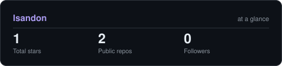
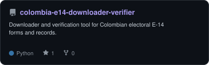

<!-- BANNER -->
<picture>
  <source media="(prefers-color-scheme: dark)"  srcset="assets/banner-dark.v9.svg">
  <source media="(prefers-color-scheme: light)" srcset="assets/banner-light.v9.svg">
  
</picture>

 

<!-- ANIMATED TYPING BANNER -->

 

<!-- SOCIALS / CONTACT -->
&nbsp;&nbsp;
&nbsp;&nbsp;

 

<!-- PROFILE VIEWS -->

---

## This is me :)

Hi, I'm **Luis Sandon**, a Software Engineering student passionate about building software and understanding how it works behind the scenes. 
My focus revolves around systems internals, C++ development, reverse engineering, security research, and modular software architecture.

- ⚙️ **Systems & C++**: Crafting low-level applications, desktop tools with ImGui, and dissecting operating system internals.
- 🔍 **Reverse Engineering & Security**: Actively studying reverse engineering, Assembly language (x86/x64), and security research concepts.
- 🏗️ **Architecture & Web**: Designing robust architectures and creating modern, high-performance web applications.
- 👯 **Collaboration**: Enthusiastic about collaborating on open-source projects and security research tools.
- ⚡ **Outside of Tech**: Playing video games, listening to music, and exploring emerging technologies.
- 📫 **Direct Reach**: [luissandon76@gmail.com](mailto:luissandon76@gmail.com)

 

## my stack

---

## signals 

<table>
<tr>
<td width="50%" align="center" valign="middle">

<!-- Self-rated radar - edit assets/skills.json, the workflow redraws it -->
<picture>
  <source media="(prefers-color-scheme: dark)"  srcset="assets/radar-dark.svg">
  <source media="(prefers-color-scheme: light)" srcset="assets/radar-light.svg">
  
</picture>

</td>
<td width="50%" align="center" valign="middle">

<!-- Language stack radar - edit assets/langmix.json -->
<picture>
  <source media="(prefers-color-scheme: dark)"  srcset="assets/radar-langs-dark.svg">
  <source media="(prefers-color-scheme: light)" srcset="assets/radar-langs-light.svg">
  
</picture>

</td>
</tr>
</table>

---

## Numbers matter? ohhh yes. 

<picture>
  <source media="(prefers-color-scheme: dark)"  srcset="assets/card-stats-dark.svg">
  <source media="(prefers-color-scheme: light)" srcset="assets/card-stats-light.svg">
  
</picture>

 

---

## featured project

<a href="https://github.com/lsandon/colombia-e14-downloader-verifier">
<picture>
  <source media="(prefers-color-scheme: dark)"  srcset="assets/card-colombia-e14-downloader-verifier-dark.svg">
  <source media="(prefers-color-scheme: light)" srcset="assets/card-colombia-e14-downloader-verifier-light.svg">
  
</picture>
</a>

---

` Built with passion · @lsandon `

